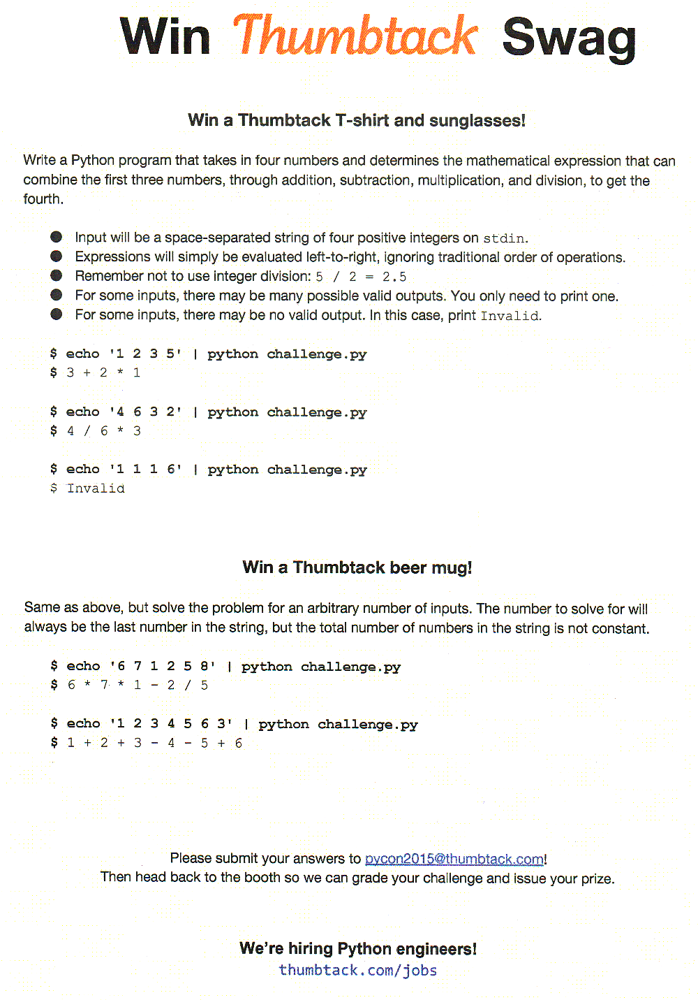

# Inspiration

Back in 2015, I attended PyCon in Montreal, Canada. It was awesome. There were lots of stalls 
from big names, and some offered interesting programming challenges.
[Thumbtack was among them](https://www.thumbtack.com/engineering/pycon-2015).


## The problem

To quote Thumbtack Engineering,

> When I was little, my family went to our town’s district math night. We came back with a game
that we still play as a family. The game is called Inspiration. It’s played with a normal deck
of cards, with the picture cards taken out. Everyone gets four cards and one card is turned 
face up for everyone to see. You then have to mathematically combine your four cards with 
addition, subtraction, multiplication, and division to get the center card. The person who 
does it the fastest wins.
>
> This year, our challenge was inspired by Inspiration, no pun intended. The first part asked 
people to write a Python program that takes in four numbers and determines the mathematical 
expression that can combine the first three numbers to get the fourth. If they could solve this,
they were awarded a t-shirt and sunglasses. The harder challenge was to solve the same problem,
but with an arbitrary number of inputs. The number to solve for was always the last number in 
the string, but the total number of operands was not constant. These solvers won the coveted 
Thumbtack beer glass.

Other than on Thumbtack's own blog, discussion and solutions (other than a
[dead link](https://gist.github.com/shayel/736f143cb4f7d2310c5b "11 lines solution for https://www.thumbtack.com/engineering/pycon-2015")
here and there) seem to be unfortunately non-existent. This kind of problem is dangerous for me 
because it's an ideal [nerd snipe](https://xkcd.com/356/): simple on its face, but with lots of 
potential for complexity given any cursory thought. And snipe it did: I've been occasionally 
thinking on and off about this for two years and counting.


### Original problem statement




### Problem formalization

Stated more formally, let there be _n_ integers _x_<sub>i</sub> on the left-hand side of an 
equation, and an integer _y_ on the right-hand side of that equation, where

n ≥ 2

0 ≤ i < n

1 ≤ x<sub>i</sub> ≤ 9

1 ≤ y ≤ 9

A strict interpretation would enforce a maximum count of four cards (suits) per card value, but 
that criterion is disregarded for the purposes of this discussion.

A strict interpretation would also impose an upper bound on _n_. Since there are 4 suits, 9 cards
per suit, a minimum of 2 players, and _n_ cards per player plus one shared _y_ card, the upper 
bound for _n_ is:

2 ≤ n ≤ (4 * 9 - 1)/2

2 ≤ n ≤ 17

There are _n_ - 1 operators ƒ<sub>i</sub> between the elements of _x_<sub>i</sub> and 
_x_<sub>i + 1</sub> . Each ƒ is a binary arithmetic operator with conventional associativity and 
commutativity but non-conventional order of operations. The equation is assumed to be evaluated in a
flat, left-to-right manner, that is,

x<sub>0</sub> [ƒ<sub>0</sub>] x<sub>1</sub> [ƒ<sub>1</sub>] x<sub>2</sub> [ƒ<sub>2</sub>] ...
[ƒ<sub>n - 2</sub>] x<sub>n - 1</sub>= y

ƒ<sub>n - 2</sub>( ... ƒ<sub>1</sub>(ƒ<sub>0</sub>(x<sub>0</sub>, x<sub>1</sub>), 
x<sub>2</sub>) ... x<sub>n - 1</sub>) = y

Each ƒ may be any of:

ƒ(a, b) ∈ { a + b, a - b, a * b, a / b }

The goal is to permute _x_ and choose each ƒ to satisfy the equation. Where there are multiple 
solutions, the first one found is taken and the rest are discarded.


### Problem Analysis

The cardinality of the ƒ function set is:

|ƒ| = 4

Assuming that the entries of _x_ are (in the worst case) unique, the number of permutations of _x_
 is _n_! .

The size _N_ of the (naïve) search space is then

N = 4<sup>n - 1</sup> ( n ! )

For given _x_ and _y_ the solution is not necessarily unique, nor is there necessarily a solution.
By example, there is no solution for

    x = (1, 1), y = 9

By contrast, given these inputs:

    x = (1, 2, 3), y = 4

There are 5 solutions out of a search space for which _N_ = 96 :

    2 - 1 + 3 = 4
    2 + 3 - 1 = 4
    3 - 1 + 2 = 4
    3 - 1 * 2 = 4
    3 + 2 - 1 = 4

Some inputs are thus more difficult than others, difficulty being measured by both the number of 
solutions in the problem space as well as (more importantly) the number of candidates assessed 
before the first solution is found.

For example, evaluating all of the possible inputs where _n_ = 4, _N_ = 1536; and using the naïve
algorithm described later, the problem difficulty is heavily dependent on which inputs are chosen.
For the following inputs, a solution is found after only 7 iterations. There are 480 solutions
(without discarding non-unique solutions):

    x = (1, 1, 1, 1), y = 1
    1 + 1 - 1 * 1 = 1
    ...

However, the following inputs only produce a solution after 1309 iterations, exhausting 85% of the 
search space; and there are only two solutions:

    x = (2, 1, 5, 9), y = 9
    9 - 1 / 2 + 5 = 9
    9 - 5 * 2 + 1 = 9


## Algorithms

### Naïve

The naïve (or brute-force) algorithm is the easiest to implement but certainly not the most 
efficient. It was the most popular (perhaps only?) algorithm seen in use at PyCon. In pseudocode 
it looks like:

    for each of n! permutations of x:
        for each of the 4^(n-1) combinations of ƒ:
            evaluate LHS
            if LHS == y:
                print solution
                exit

A brief implementation of this algorithm (indeed, briefer than what I submitted in 2015) is:

```python
#!/usr/bin/env python3
import functools, itertools, operator as opr, re, sys

operators = tuple(zip((opr.add, opr.sub, opr.mul, opr.truediv), '+-*/'))
inputs = [int(i) for i in re.findall('\S+', sys.stdin.readline())]
for perm in itertools.permutations(inputs[:-1]):
    for ops in itertools.product(operators, repeat=len(perm)-1):
        funcs = tuple(zip(ops, perm[1:]))
        if inputs[-1] == functools.reduce(lambda n, fun: fun[0][0](n, fun[1]), funcs, perm[0]):
            print(perm[0], ' '.join('%s %d' % (o[1], n) for o, n in funcs))
            sys.exit()
print('Invalid')
```

There are surely ways to code-golf this down even further, but this implementation is non-magical -
it simply uses:
* _itertools.permutations_ to search through all _x_; 
* _itertools.product_ (as in, the Cartesian product) with _repeat_ set to _n_ - 1 to search 
  through all ƒ; and
* _functools.reduce_ to evaluate the result.

This brute-force method can be very slow: since the search through _x_ is O(n!), the search 
through ƒ is O(4<sup>n - 1</sup>), and the evaluation of the LHS is O(n), the overall worst-case
runtime is O(n! 4<sup>n - 1</sup> n) .


### Recursive-ƒ

Whenever a new ƒ is attempted in the naïve algorithm, it takes O(n) time to re-evaluate the LHS in
order to compare it to _y_ on the RHS - but this O(n) factor can be reduced.

A recursive function can be used that, either from left to right or right to left, iterates 
through the possibilities for ƒ<sub>i</sub> at four times the speed of ƒ<sub>i - 1</sub>. Even 
though it is more complicated than calling _itertools.product_, it offers speedup by reducing
evaluation redundancy. This is achieved on every recursion at depth _i_, reusing the prior value 
computed at upper depths 0 through _i_ - 1.


### Gray code

As with the recursive-ƒ algorithm, the O(n) factor can be reduced by eliminating some redundant 
re-evaluation of sections of the LHS. In this case, we attempt this by ensuring that only one
ƒ<sub>i</sub> changes at a time, reducing this factor to O(1).

[Gray code](https://en.wikipedia.org/wiki/Gray_code#n-ary_Gray_code) is a method of incrementing
numbers such that only one digit changes at a time, but all possible values are still visited. For 
instance, for a 3-bit binary integer:

    0 0 0
    0 0 1
    0 1 1
    0 1 0
    1 1 0
    1 1 1
    1 0 1
    1 0 0

ƒ can be modelled as a radix-4 integer with _n_ - 1 digits, where each digit represents one 
operator, and the integer increments from 0 through 4<sup>n - 1</sup> - 1. There is benefit to 
having it increment by (4,_n_)-Gray code instead of linearly. Whenever an ƒ<sub>i</sub> changes, the
computed value from ƒ<sub>0</sub> through ƒ<sub>i - 1</sub> can stay the same; and the computed 
composite function equivalent to ƒ<sub>i + 1</sub> through ƒ<sub>n - 2</sub> can also stay the same.

For _n_ = 4 and a single permutation of _x_, the search through all ƒ would look like:

    + + +
    + + -
    + + *
    + + /
    + - /
    + - +
    + - -
    + - *
    + * *
    + * /
    + * +
    + * -
    ...

This optimization will have the greatest effect when the player has a large hand of up to 17 cards.


### Heap's Permutations

Similar in spirit to the Gray code approach, there is benefit to reducing the number of changed 
elements between permutations of _x_.
[Heap's permutation algorithm](https://en.wikipedia.org/wiki/Heap%27s_algorithm) is designed 
specifically for this purpose. It guarantees that iteration through all permutations only does a 
single swap of two elements at a time. The canonical implementation of the algorithm swaps most 
frequently at the beginning of the set, but a simple index reversal allows swaps to occur most 
frequently at the end, allowing more of the computed portion of the LHS to be saved from 
iteration to iteration.

For _n_ = 4, disregarding ƒ, the search through _x_ would look like:

    (0, 1, 2, 3)
    (0, 1, 3, 2)
    (0, 2, 3, 1)
    (0, 2, 1, 3)
    (0, 3, 1, 2)
    (0, 3, 2, 1)
    (1, 3, 2, 0)
    (1, 3, 0, 2)
    (1, 2, 0, 3)
    (1, 2, 3, 0)
    (1, 0, 3, 2)
    (1, 0, 2, 3)
    ...


### Gray-Heap Iteration

It would be interesting to try combined Gray-Heap iteration using the above methods. This would 
produce a series of LHS candidates looking like:

    1 + 2 + 3 + 4
    1 + 2 + 3 - 4
    1 + 2 + 3 * 4
    1 + 2 + 3 / 4
    1 + 2 - 3 / 4
    ...
    4 - 3 + 2 - 1
    4 - 3 + 2 * 1
    4 - 3 + 2 / 1
    4 - 3 + 2 + 1
    4 - 3 + 1 + 2
    4 - 3 + 1 - 2
    4 - 3 + 1 * 2
    4 - 3 + 1 / 2
    ...
    4 + 1 / 2 - 3
    4 + 1 + 2 - 3
    4 + 1 + 2 * 3
    4 + 1 + 2 / 3
    4 + 1 + 2 + 3


### Condensed-section

todo.


## Hardware Considerations

### Precision

The equation with the maximal intermediate value is where _n_ takes its maximum of 17, _x_ and _y_ 
take their maxima of 9, and only multiplication and division are used:

    9^8 / 9^8 * 9 = 9

The maximal intermediate value then requires an integer width of:

    ceil( 8*ln(9)/ln(2) ) = 26 bits

If using integer math with a fraction, 32-bit signed integers will suffice. 

Single-precision (32-bit) floating-point has a 24-bit significand. As such, it would suffice for _n_
≤ 15, since 9<sup>7</sup> < 2<sup>24</sup>. Above that, it is insufficient for the worst edge 
cases, and double (64-bit) floating-point would be required instead.

### Parallelism

The naïve algorithm is easily parallelized (and is, perhaps, even one of
[Moler's embarassingly parallel](https://en.wikipedia.org/wiki/Embarrassingly_parallel#Etymology)
problems).
The simplest method is to perform the permutation in a parent thread and assign subdivided ƒ search 
space to _m_ children, such that all children have the same set of inputs in the same order but 
attempt different combinations for ƒ. Each child will have a search space size of 4<sup>n - 
1</sup>/m . Whichever child finds the first solution returns it to the parent, the parent cancels
all children and completes execution. In pseudocode,

    for each of n! permutations of x:
        fork m children each searching 4^(n-1) / m combinations of ƒ
        join on any child completion
        if a child found a solution:
            cancel other children
            print solution
            exit
        join on all remaining children

### Parallelism with SIMD

A more carefully optimized solution would be to use
[SIMD](https://en.wikipedia.org/wiki/SIMD) on an appropriate processor architecture - either on a 
CPU or a GPU.

Contemporary Intel CPUs offer up to
[28 cores](https://en.wikipedia.org/wiki/List_of_Intel_Xeon_microprocessors#.22Skylake-SP.22_.2814_nm.29_Scalable_Performance),
2 semi-parallel "hyper-threads" per core, and
[512-bit-wide vectorized math](https://en.wikipedia.org/wiki/AVX-512). In 512-bit single-precision 
vectorized mode, 16 values can be operated upon at once. This all allows a theoretical parallel 
speedup factor of up to 896.

Using [GPGPU](https://en.wikipedia.org/wiki/General-purpose_computing_on_graphics_processing_units)
can offer even greater parallel speedup. For example, nVidia offers GPUs with core counts well in 
excess of
[4,000](https://en.wikipedia.org/wiki/List_of_Nvidia_graphics_processing_units#Tesla) before 
taking other parallelism into account. There are various Python bindings for
[OpenCL](https://en.wikipedia.org/wiki/OpenCL) able to target this hardware.

Using a SIMD scheme, there would be two levels of parallelism: core/thread children, and vectorized 
elements within each of those cores. Within a single core, each element of the vectorized operation
would have to have a different set of _x_ inputs but the same ƒ operations. Division of the _x_ 
search space would then need to occur across SIMD elements, with all elements in the core using the
same ƒ set. The top-level parent would divide the ƒ search space across cores.
